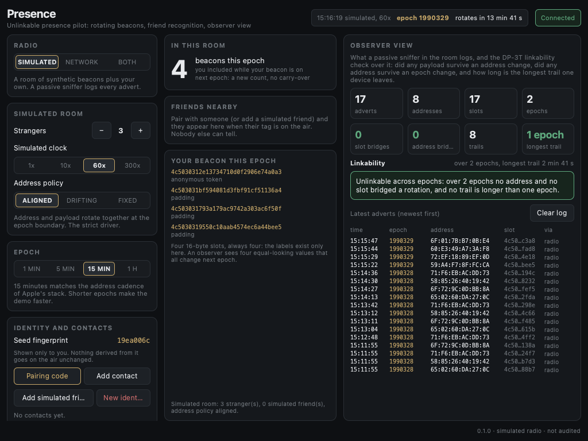
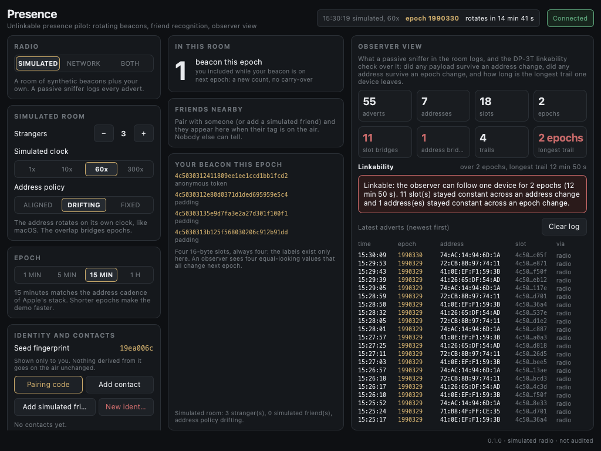
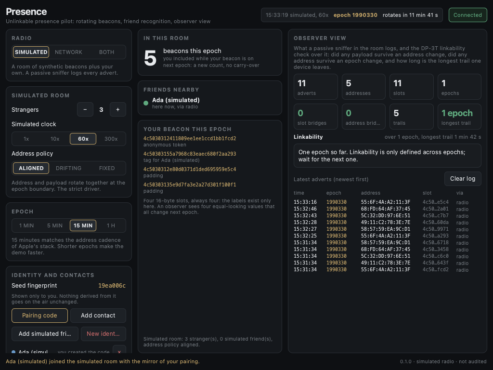

# Basecamp Presence

> **Disclaimer.** This is a personal, experimental hobby project. It is not an
> official Logos product. Not audited. It is provided as is, with no warranty of
> any kind and no affiliation with or endorsement by any of the projects it
> interoperates with — see [License](#license).

An unofficial pilot app for the Basecamp desktop shell that shows what
*unlinkable presence* looks like: a device announces "I am here" every epoch
with a token that no passive observer can link to the token it used in the
previous epoch, while paired friends still recognise each other.

It is a `ui_qml` module: a QML view rendered by Basecamp, with a
process-isolated C++ backend. The radio layer is **simulated** (a room of
synthetic beacons plus your own, logged by a passive sniffer) and, optionally,
**carried over Logos Messaging** so two Basecamps on the testnet see each
other's beacons. Nothing in this build touches a Bluetooth radio. The key
schedule, the on-air slot format and the observer analysis are what a real BLE
driver would use; the driver is the part this pilot leaves out, on purpose,
because no desktop stack lets an app rotate the controller address in step
with its payload without privileged or dedicated hardware.

The study behind it, written for researchers, is in
[docs/unlinkable-presence.md](docs/unlinkable-presence.md): definitions, the
BitChat and Briar facts and the assumptions each implies, what this pilot
simulates, twelve numbered assumptions, nine outcomes with pass and fail
criteria, and eleven outstanding gaps.

## What it does

- **Headcount.** How many beacons are in the room this epoch, with no beacon
  linkable to itself in the next epoch.
- **Friends nearby.** Contacts paired with a one-time code recognise each
  other through per-epoch pairwise tags. Nobody else can tell who they are, or
  that two beacons are friends.
- **Observer view.** The log a passive sniffer would keep (address, slot,
  time) and the DP-3T style check over it: did any slot survive an address
  change, did any address survive an epoch change, and how long is the longest
  trail one device leaves. Three address policies make the lesson visible:
  - *aligned*: address and payload rotate together. Trails are one epoch long.
  - *drifting*: the address rotates on its own clock (what macOS does). The
    overlap bridges epochs and the observer follows a device for hours.
  - *fixed*: the address never changes (stock BlueZ). Everything links.
- **Network twin.** Switch the radio to NETWORK and the same slots are
  published on `/logos-presence/1/room-<code>/json` through `delivery_module`
  with `messagingOverrides.anonymityLevel` (None, Preferred, Required).
  Another Basecamp in the same room sees your beacon; with a pairing code it
  recognises you.

Everywhere: an accelerated simulated clock (1x to 300x) so a 15-minute epoch
passes in seconds, epoch lengths from one minute to one hour, pairing codes,
simulated friends, and a "new identity" button that replaces the seed and
forgets every pairing.

## Screenshots

Aligned address policy, two epochs in: the observer finds no bridge and no
trail longer than one epoch.



Drifting address policy (the macOS situation): slots survive address changes,
one address survives an epoch change, and the observer follows a device for
two epochs.



A simulated friend paired with the mirror key is recognised through its
per-epoch tag; nobody else can.



## What is Basecamp?

Basecamp is a desktop shell that lets you discover, install, and run modules
and apps from a graphical interface instead of the command line. It is a
separate, independently maintained project ([docs](https://docs.logos.co/basecamp)
· [source](https://github.com/logos-co/logos-basecamp)). This app is not part
of it — it simply installs into Basecamp and runs there.

**Get Basecamp:** download the latest release from
[logos-co/logos-basecamp/releases/latest](https://github.com/logos-co/logos-basecamp/releases/latest).
Releases are published as:

| File | Platform |
|---|---|
| `LogosBasecamp-Desktop-v<ver>-<sha>-aarch64.dmg` | macOS Apple Silicon |
| `LogosBasecamp-Desktop-v<ver>-<sha>-x86_64.AppImage` | Linux x86_64 |
| `LogosBasecamp-Desktop-v<ver>-<sha>-aarch64.AppImage` | Linux ARM64 |

On Linux, `chmod +x` the AppImage and run it. There is currently no macOS
Intel build, so Intel Macs need to build Basecamp from source.

This app is developed against Basecamp 0.3.x (verified on 0.3.0).

## Dependencies

Runtime:

| Dependency | Needed for | How it is declared |
|---|---|---|
| Basecamp 0.3.x | everything | host application |
| `delivery_module` >= 0.3.0 | NETWORK mode only | `optional_dependencies` in [metadata.json](metadata.json) |

`delivery_module` is optional on purpose: Basecamp loads Presence without it,
and the simulated room, the observer view and pairing all work offline. For
the network twin, install `delivery_module` from **Modules** (official Logos
repository, about 96 MB) and load it. Two presets are offered. `logos.test`
rate-limits every send with an RLN proof, which needs a funded membership on
the LEZ testnet (no faucet; see the Logos journey "Run a delivery node with
RLN"); without one every send fails after its retry window. `logos.dev` has
no rate-limit gate and is where the network twin was first exercised. The anonymity level is fixed when the
delivery node is created, so if another app (Chat) created the node first its
level applies and the UI says so.

The package bundles its own support libraries (`libcrypto`, `libssl`,
`libboost_system`) through the module builder. The module's own cryptography
(SHA-256, HMAC) is in-tree and Qt-free; there is no OpenSSL call in the source.

Build and test:

| Tool | Needed for |
|---|---|
| Nix with flakes | every build; inputs `logos-module-builder` and `logos-delivery-module` are pinned in `flake.lock` |
| Node.js | the UI tests, through the builder's test framework (`nix build .#test-framework`) |
| a C++17 compiler | the native core test, no Nix needed |
| Python 3 with Pillow | `scripts/make_icon.py` only |

## Install

Download the `.lgx` for your platform from the
[latest release](../../releases/latest):

| Asset | Platform | Variant inside |
|---|---|---|
| `presence_ui-darwin-arm64.lgx` | macOS Apple Silicon | `darwin-arm64` |
| `presence_ui-linux-x86_64.lgx` | Linux x86_64 (Debian, Ubuntu, …) | `linux-amd64` |
| `presence_ui-linux-aarch64.lgx` | Linux ARM64 | `linux-arm64` |

Then in Basecamp open **Modules**, click **Install LGX Package**, select the
file, and **Load** it. Presence appears with the rings icon.

Command-line alternative. Basecamp resolves its data directory via Qt's
`AppDataLocation`, and a `ui_qml` package goes into the UI plugins directory,
not the core modules directory:

```bash
# macOS
BASECAMP_DIR="$HOME/Library/Application Support/Logos/LogosBasecamp"
# Linux
# BASECAMP_DIR="$HOME/.local/share/Logos/LogosBasecamp"

lgpm --modules-dir "$BASECAMP_DIR/modules" --ui-plugins-dir "$BASECAMP_DIR/plugins" \
     --allow-unsigned install --file presence_ui-darwin-arm64.lgx
```

A running Basecamp only scans its plugins at startup: click **Modules →
Reload** (or relaunch), then **Load** Presence. When upgrading from an
earlier version, relaunch Basecamp rather than Unload and Load: the shell keeps
the previous version's view plugin in memory, and a changed view contract then
shows "Connecting to backend..." forever (`qt.remoteobjects: Signature
mismatch` in the log). If Basecamp was launched with
`--user-dir` (or `LOGOS_USER_DIR`), use that path as `BASECAMP_DIR`.

Release assets are portable builds (self-contained, bundled support
libraries). If your platform has no prebuilt asset yet, build from source.

## Design in one screen

```
epoch E      = floor(unix / T)                      T = 15 min by default
anon token   = HMAC-SHA256(seed, "presence/v1/anon" || E)[0:12]
pair tag     = HMAC-SHA256(K_AB,  "presence/v1/tag"  || E || role)[0:12]
padding      = HMAC-SHA256(seed, "presence/v1/pad"  || E || i)[0:12]
slot         = "LP01" || payload[12]                 16 bytes, one per advert
beacon       = exactly 4 slots per epoch: anon, then one tag per contact, then padding
```

- The seed and pairing keys never leave the device. Tokens are HMACs under
  secret material, so an observer who has every past token cannot compute the
  next one.
- Tags are directional: the side that created the code emits role 0, the side
  that pasted it emits role 1, and each computes the other's.
- The slot count is fixed and padding is derived, so the number of contacts
  is not on the air and padding cannot be told apart from real slots.
- Receivers accept epochs E-1, E and E+1 for clock skew.
- Observations live in memory only. Nothing about other devices is written to
  disk. Your own seed (mode 0600) and contacts live under the ui-host data
  directory.

## Build from source

Requires Nix with flakes ([install](https://nixos.org/download/)).

```bash
git clone https://github.com/IP3-Studio/Basecamp-presence-pilot
cd Basecamp-presence-pilot
nix build                      # compile the plugin
nix run .                      # open it in logos-standalone-app
nix build .#lgx-portable       # package a shareable .lgx for your platform

DEV_QML_PATH=$PWD/src/qml nix run .   # live-reload QML while hacking
nix build .#integration-test -L       # run the five UI tests headless
```

The Qt-free core has a native test that needs no Nix:

```bash
c++ -std=c++17 -Wall -Wextra -I src -o /tmp/core_test tests/core_test.cpp src/presence_core.cpp && /tmp/core_test
```

To run the UI tests against a live app and keep the screenshots, start the app
yourself (`nix run . -- -platform offscreen`), wait for the inspector on port
3768, then `node tests/ui-tests.mjs` with `LOGOS_QT_MCP` pointing at a
`nix build .#test-framework -o result-mcp` output and `PRESENCE_SCREENSHOT`
set to a path.

## How it works

```
Basecamp (or logos-standalone-app)
  ├─ renders src/qml/Main.qml (three panels: radio and identity, in this room, observer view)
  └─ spawns ui-host with presence_ui_plugin
        └─ PresenceUiBackend
             ├─ presence_core: key schedule, slot format, observer analysis, room simulator
             ├─ SimRoom ........... synthetic beacons + your own, one observation log
             └─ delivery_module ... optional: the same slots on a Logos content topic
```

QML and backend talk over Qt Remote Objects; the contract lives in
[src/presence_ui.rep](src/presence_ui.rep). The backend pushes JSON snapshots
(friends, beacon, observations, linkability report) as properties once a
second; the view parses them. A backend crash cannot take Basecamp down.

## Layout

```
├── metadata.json                    # module manifest (type: ui_qml, universal, optional delivery_module)
├── flake.nix                        # builds via logos-module-builder
├── src/
│   ├── presence_core.{h,cpp}        # Qt-free core: crypto, schedule, observer model, simulator
│   ├── presence_ui.rep              # QtRO view contract
│   ├── presence_ui_backend.{h,cpp}  # room, identity, contacts, delivery glue
│   └── qml/Main.qml                 # the view
├── icons/presence.png               # generated by scripts/make_icon.py
├── docs/screenshots/                # from the headless UI test run
└── tests/
    ├── core_test.cpp                # native unit test for the core
    └── ui-tests.mjs                 # five headless UI tests
```

## Known limitations

- The radio is simulated. The pilot proves the schedule and the observer
  argument; it does not prove a Bluetooth stack rotates its address in step.
  On macOS the OS rotates the address on its own clock (about 15 minutes), so
  the best achievable property there is epoch-limited linkability, and the
  app cannot use CoreBluetooth inside Basecamp at all until Basecamp carries a
  Bluetooth usage string. Stock BlueZ advertises from the public address
  unless privacy is switched on in `main.conf`.
- Pairing codes are a symmetric secret, trust on first use through whatever
  channel carried them. Public-key pairing is the next step.
- The network twin depends on the Logos testnet mix pool. `Required` fails
  closed when no mix path exists; `Preferred` falls back to a direct send and
  is then not anonymous. Store nodes keep published beacons for three days;
  they are unlinkable by construction, but topic, size and timing are visible
  to every node on the cluster.
- Advertisement shape and timing are a fingerprint of "a presence beacon".
  That is outside what token rotation can fix.
- The core is plain C++17 with no Qt, ready to move to a mobile build. A real
  driver implements one interface: emit the four slots for the current epoch
  and hand every received advertisement to the observation log.

## Contributing

Contributions are welcome — issues and pull requests both. Build it with Nix
(see [Build from source](#build-from-source)); `DEV_QML_PATH=$PWD/src/qml nix run .`
live-reloads the QML while you work, and `nix build .#integration-test -L` runs
the tests.

Where things live: [src/presence_ui.rep](src/presence_ui.rep) is the contract
between the view and the backend, so a new feature usually means adding a SLOT
or PROP there first, implementing it in
[src/presence_ui_backend.cpp](src/presence_ui_backend.cpp), and binding it in
[src/qml/Main.qml](src/qml/Main.qml). Anything that touches the key schedule
or the observer check belongs in [src/presence_core.cpp](src/presence_core.cpp)
with a case in [tests/core_test.cpp](tests/core_test.cpp).

## License

Licensed under either of [Apache License 2.0](LICENSE-APACHE) or
[MIT license](LICENSE-MIT) at your option. Both disclaim all warranties and
liability; this software is provided as is.

Logos, Basecamp and the Logos modules are separate projects under their own
licences. This module does not bundle them; it installs into Basecamp and,
when asked, talks to the delivery module it finds there.
